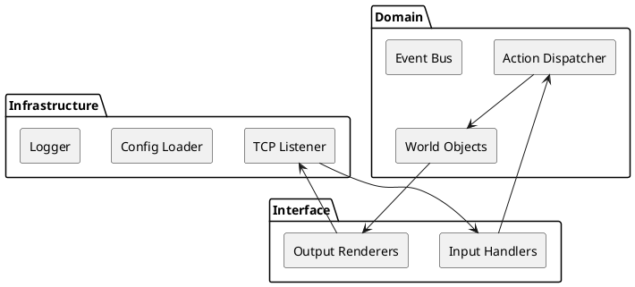

# Internal Architecture & Extension Points

This chapter digs into the **SOLID** object-oriented design underpinning Aethyr.  You will learn where to plug in new features without breaking existing gameplay.

---

## 1. Layer Cake Overview



Each layer depends **only** on the layer directly beneath it (Dependency Inversion Principle), enabling you to introduce, for instance, a *WebSocket* listener without touching the domain.

---

## 2. Key Classes & Responsibilities

| Class | Responsibility (SRP) | Module |
|-------|----------------------|--------|
| `Aethyr::Core::Connection::Server` | Accept TCP connections and multiplex them. | Infrastructure |
| `Aethyr::Core::Actions::Parser` | Parse raw input into strongly-typed *Action* objects. | Interface |
| `Aethyr::Core::Actions::Action` | Base class for game verbs; obeys the **Command Pattern**. | Domain |
| `Aethyr::Core::Objects::BaseObject` | Abstract super-class for every persistent entity. | Domain |
| `Aethyr::Core::Util::EventBus` | Publish/subscribe bus for decoupled events. | Infrastructure |

---

## 3. Extending with New Commands

1. **Create** a file under `lib/aethyr/extensions/actions/commands/myverb.rb`.
2. **Subclass** `Aethyr::Extend::CommandAction`.
3. **Implement** `#action` – keep it *short*; delegate heavy lifting to helper classes.

```ruby title="lib/aethyr/extensions/actions/commands/rub.rb"
class RubCommand < Aethyr::Extend::CommandAction
  def action
    if self[:at]
      target = @player.container.find(self[:at])
      @player.output "You rub #{target.name} affectionately." if target
    else
      @player.output "Rub what?"
    end
  end
end
```

The file is auto-loaded on startup (or via `areload`).  The command name defaults to the snake-cased class name (`rub`), but you can override `self.command_names` to expose aliases.

---

## 4. Dependency Injection Example

Input handlers accept a **strategy object** that maps telnet options to internal features.  Swap it for your own implementation at boot:

```ruby
Aethyr::Core::Connection::Server.strategy = MyCustomNegotiator.new
```

Because handlers depend on the *abstraction* `Negotiator` instead of a concrete class, this fulfills the **Open/Closed Principle**.

---

## 5. Unit Testing an Extension

All extension gems live under `lib/aethyr/extensions/*`.  You can add **RSpec** specs or **Cucumber** features next to the code.

```bash
$ bundle exec rake unit FEATURE=tests/unit/myverb.feature
```

Make sure to follow the **custom instructions** in root for exhaustive, granular steps.

---

Advance to **[Extending Aethyr](extending)** for a tutorial-style walk-through. 