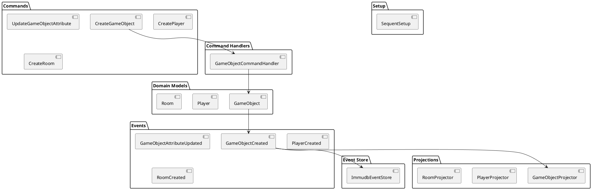

# Event Sourcing API Reference

This document provides a comprehensive reference for developers who want to work with Aethyr's event sourcing system. It covers the core classes, interfaces, and extension points, providing detailed information about how to use, extend, and customize the event sourcing system.

## Core Components

The event sourcing system consists of several key components that work together to provide a robust, flexible framework for event‐based state management. Understanding these components and their interactions is essential.



### Commands

Commands represent intentions to change the state. They are validated and then processed to trigger events.

#### Base Command Class

All commands inherit from `Sequent::Command`:

```ruby
class Sequent::Command
  # Unique identifier for the command
  attr_accessor :id
  
  # Aggregate ID this command targets
  attr_accessor :aggregate_id
  
  # Command creation timestamp
  attr_accessor :created_at
  
  # Validation errors
  attr_reader :errors
  
  # Check if command is valid
  def valid?
    # ...
  end
end
```

### GameObject Commands

```ruby
# Create a new game object
class CreateGameObject < Sequent::Command
  attrs id: String, name: String, generic: String, container_id: String
  validates :id, :name, presence: true
end

# Update a single attribute of a game object
class UpdateGameObjectAttribute < Sequent::Command
  attrs id: String, key: String, value: Object
  validates :id, :key, presence: true
end

# Update multiple attributes of a game object
class UpdateGameObjectAttributes < Sequent::Command
  attrs id: String, attributes: Hash
  validates :id, :attributes, presence: true
end

# Move a game object to a new container
class UpdateGameObjectContainer < Sequent::Command
  attrs id: String, container_id: String
  validates :id, :container_id, presence: true
end

# Delete a game object
class DeleteGameObject < Sequent::Command
  attrs id: String
  validates :id, presence: true
end
```

### Player Commands

```ruby
# Create a new player
class CreatePlayer < Sequent::Command
  attrs id: String, name: String, password_hash: String
  validates :id, :name, :password_hash, presence: true
end

# Update a player's password
class UpdatePlayerPassword < Sequent::Command
  attrs id: String, password_hash: String
  validates :id, :password_hash, presence: true
end

# Update a player's admin status
class UpdatePlayerAdminStatus < Sequent::Command
  attrs id: String, admin: Boolean
  validates :id, presence: true
end
```

### Room Commands

```ruby
# Create a new room
class CreateRoom < Sequent::Command
  attrs id: String, name: String, description: String
  validates :id, :name, presence: true
end

# Update a room's description
class UpdateRoomDescription < Sequent::Command
  attrs id: String, description: String
  validates :id, :description, presence: true
end

# Add an exit to a room
class AddRoomExit < Sequent::Command
  attrs id: String, direction: String, target_room_id: String
  validates :id, :direction, :target_room_id, presence: true
end

# Remove an exit from a room
class RemoveRoomExit < Sequent::Command
  attrs id: String, direction: String
  validates :id, :direction, presence: true
end
```

### Command Handlers

```ruby
class GameObjectCommandHandler < Sequent::CommandHandler
  # Handle CreateGameObject command
  on CreateGameObject do |command|
    repository.add_aggregate(Domain::GameObject.new(command.id, command.name, command.generic, command.container_id))
  end
  
  # Handle UpdateGameObjectAttribute command
  on UpdateGameObjectAttribute do |command|
    do_with_aggregate(command.id, Domain::GameObject) do |game_object|
      game_object.update_attribute(command.key, command.value)
    end
  end
  
  # Handle UpdateGameObjectAttributes command
  on UpdateGameObjectAttributes do |command|
    do_with_aggregate(command.id, Domain::GameObject) do |game_object|
      game_object.update_attributes(command.attributes)
    end
  end
  
  # Handle UpdateGameObjectContainer command
  on UpdateGameObjectContainer do |command|
    do_with_aggregate(command.id, Domain::GameObject) do |game_object|
      game_object.update_container(command.container_id)
    end
  end
  
  # Handle DeleteGameObject command
  on DeleteGameObject do |command|
    do_with_aggregate(command.id, Domain::GameObject) do |game_object|
      game_object.delete
    end
  end
  
  # ... additional handlers for Player and Room commands
end
```

### Domain Models (Aggregates)

```ruby
class GameObject < Sequent::AggregateRoot
  attr_reader :name, :generic, :container_id, :attributes
  
  def initialize(id, name, generic, container_id = nil)
    super(id)
    apply GameObjectCreated, name: name, generic: generic, container_id: container_id, attributes: {}
  end
  
  # Command handlers
  def update_attribute(key, value)
    apply GameObjectAttributeUpdated, key: key, value: value
  end
  
  def update_attributes(attributes)
    apply GameObjectAttributesUpdated, attributes: attributes
  end
  
  def update_container(container_id)
    apply GameObjectContainerUpdated, container_id: container_id
  end
  
  def delete
    apply GameObjectDeleted
  end
  
  # Event handlers
  on GameObjectCreated do |event|
    @name = event.name
    @generic = event.generic
    @container_id = event.container_id
    @attributes = event.attributes || {}
    @deleted = false
  end
  
  on GameObjectAttributeUpdated do |event|
    @attributes[event.key] = event.value
  end
  
  on GameObjectAttributesUpdated do |event|
    event.attributes.each do |key, value|
      @attributes[key] = value
    end
  end
  
  on GameObjectContainerUpdated do |event|
    @container_id = event.container_id
  end
  
  on GameObjectDeleted do |_|
    @deleted = true
  end
  
  def deleted?
    @deleted
  end
end
```

```ruby
class Player < GameObject
  attr_reader :password_hash, :admin
  
  def initialize(id, name, password_hash)
    super(id, name, "player")
    apply PlayerCreated, password_hash: password_hash, admin: false
  end
  
  def set_password(password_hash)
    apply PlayerPasswordUpdated, password_hash: password_hash
  end
  
  def set_admin(admin)
    apply PlayerAdminStatusUpdated, admin: admin
  end
  
  # Event handlers
  on PlayerCreated do |event|
    @password_hash = event.password_hash
    @admin = event.admin
  end
  
  on PlayerPasswordUpdated do |event|
    @password_hash = event.password_hash
  end
  
  on PlayerAdminStatusUpdated do |event|
    @admin = event.admin
  end
end
```

```ruby
class Room < GameObject
  attr_reader :description, :exits
  
  def initialize(id, name, description)
    super(id, name, "room")
    apply RoomCreated, description: description, exits: {}
  end
  
  def update_description(description)
    apply RoomDescriptionUpdated, description: description
  end
  
  def add_exit(direction, target_room_id)
    apply RoomExitAdded, direction: direction, target_room_id: target_room_id
  end
  
  def remove_exit(direction)
    apply RoomExitRemoved, direction: direction
  end
  
  # Event handlers
  on RoomCreated do |event|
    @description = event.description
    @exits = event.exits || {}
  end
  
  on RoomDescriptionUpdated do |event|
    @description = event.description
  end
  
  on RoomExitAdded do |event|
    @exits[event.direction] = event.target_room_id
  end
  
  on RoomExitRemoved do |event|
    @exits.delete(event.direction)
  end
end
```

### Events

```ruby
# GameObject Events
class GameObjectCreated < Sequent::Event
  attrs name: String, generic: String, container_id: String, attributes: Hash
end

class GameObjectAttributeUpdated < Sequent::Event
  attrs key: String, value: Object
end

class GameObjectAttributesUpdated < Sequent::Event
  attrs attributes: Hash
end

class GameObjectContainerUpdated < Sequent::Event
  attrs container_id: String
end

class GameObjectDeleted < Sequent::Event
end
```

```ruby
# Player Events
class PlayerCreated < Sequent::Event
  attrs password_hash: String, admin: Boolean
end

class PlayerPasswordUpdated < Sequent::Event
  attrs password_hash: String
end

class PlayerAdminStatusUpdated < Sequent::Event
  attrs admin: Boolean
end
```

```ruby
# Room Events
class RoomCreated < Sequent::Event
  attrs description: String, exits: Hash
end

class RoomDescriptionUpdated < Sequent::Event
  attrs description: String
end

class RoomExitAdded < Sequent::Event
  attrs direction: String, target_room_id: String
end

class RoomExitRemoved < Sequent::Event
  attrs direction: String
end
```

### Event Store

```ruby
class ImmudbEventStore < Sequent::Core::EventStore
  def initialize(config = {})
    begin
      require 'immudb-ruby'
      @use_immudb = true
      @client = config[:client] || ImmuDB::Client.new(
        address: config[:address] || ServerConfig[:immudb_address] || "127.0.0.1",
        port: config[:port] || ServerConfig[:immudb_port] || 3322,
        username: config[:username] || ServerConfig[:immudb_username] || "immudb",
        password: config[:password] || ServerConfig[:immudb_password] || "immudb",
        database: config[:database] || ServerConfig[:immudb_database] || "aethyr"
      )
    rescue LoadError => e
      log "ImmuDB not available, using file-based event store: #{e.message}", Logger::Medium
      @use_immudb = false
      @storage_path = config[:storage_path] || "storage/events"
      FileUtils.mkdir_p(@storage_path)
    end
    
    @metrics = {
      events_stored: 0,
      store_failures: 0,
      events_loaded: 0,
      load_failures: 0,
      snapshots_stored: 0,
      snapshots_loaded: 0
    }
    @mutex = Mutex.new
    @retry_count = config[:retry_count] || DEFAULT_RETRY_COUNT
    @retry_delay = config[:retry_delay] || DEFAULT_RETRY_DELAY
    ensure_database_exists if @use_immudb
    @event_counters = Concurrent::Map.new
  end
  
  def store_events(events)
    # Implementation details...
  end
  
  def load_events(aggregate_id)
    # Implementation details...
  end
  
  def store_snapshot(aggregate_id, event)
    # Implementation details...
  end
  
  def load_snapshot(aggregate_id)
    # Implementation details...
  end
  
  def statistics
    # Implementation details...
  end
  
  def reset!
    # Implementation details...
  end
end
```

### Projections

```ruby
class GameObjectProjector < Sequent::Projector
  manages_tables :game_objects
  
  on GameObjectCreated do |event|
    create_record(
      :game_objects,
      aggregate_id: event.aggregate_id,
      name: event.name,
      generic: event.generic,
      container_id: event.container_id,
      attributes: Marshal.dump(event.attributes || {}),
      deleted: false
    )
  end
  
  on GameObjectAttributeUpdated do |event|
    update_all_records(
      :game_objects,
      {aggregate_id: event.aggregate_id},
      {attributes: -> (record) { Marshal.dump(Marshal.load(record.attributes).merge(event.key => event.value)) }}
    )
  end
  
  on GameObjectAttributesUpdated do |event|
    update_all_records(
      :game_objects,
      {aggregate_id: event.aggregate_id},
      {attributes: -> (record) { 
        current_attrs = Marshal.load(record.attributes)
        Marshal.dump(current_attrs.merge(event.attributes)) 
      }}
    )
  end
  
  on GameObjectContainerUpdated do |event|
    update_all_records(
      :game_objects,
      {aggregate_id: event.aggregate_id},
      {container_id: event.container_id}
    )
  end
  
  on GameObjectDeleted do |event|
    update_all_records(
      :game_objects,
      {aggregate_id: event.aggregate_id},
      {deleted: true}
    )
  end
end
```

```ruby
class PlayerProjector < Sequent::Projector
  manages_tables :players
  
  on PlayerCreated do |event|
    create_record(
      :players,
      aggregate_id: event.aggregate_id,
      password_hash: event.password_hash,
      admin: event.admin
    )
  end
  
  on PlayerPasswordUpdated do |event|
    update_all_records(
      :players,
      {aggregate_id: event.aggregate_id},
      {password_hash: event.password_hash}
    )
  end
  
  on PlayerAdminStatusUpdated do |event|
    update_all_records(
      :players,
      {aggregate_id: event.aggregate_id},
      {admin: event.admin}
    )
  end
end
```

```ruby
class RoomProjector < Sequent::Projector
  manages_tables :rooms
  
  on RoomCreated do |event|
    create_record(
      :rooms,
      aggregate_id: event.aggregate_id,
      description: event.description,
      exits: Marshal.dump(event.exits || {})
    )
  end
  
  on RoomDescriptionUpdated do |event|
    update_all_records(
      :rooms,
      {aggregate_id: event.aggregate_id},
      {description: event.description}
    )
  end
  
  on RoomExitAdded do |event|
    update_all_records(
      :rooms,
      {aggregate_id: event.aggregate_id},
      {exits: -> (record) { 
        exits = Marshal.load(record.exits)
        exits[event.direction] = event.target_room_id
        Marshal.dump(exits)
      }}
    )
  end
  
  on RoomExitRemoved do |event|
    update_all_records(
      :rooms,
      {aggregate_id: event.aggregate_id},
      {exits: -> (record) { 
        exits = Marshal.load(record.exits)
        exits.delete(event.direction)
        Marshal.dump(exits)
      }}
    )
  end
end
```

### Setup and Configuration

```ruby
class SequentSetup
  def self.configure
    log "Configuring Sequent with event store", Logger::Medium
    Sequent.configure do |config|
      config.event_store = ImmudbEventStore.new
      config.command_handlers = [
        GameObjectCommandHandler.new
      ]
      config.event_handlers = [
        GameObjectProjector.new,
        PlayerProjector.new,
        RoomProjector.new
      ]
      config.event_publisher = Sequent::Core::EventPublisher.new
    end
    log "Sequent configured successfully", Logger::Medium
    return true
  end
  
  def self.rebuild_world_state
    log "Rebuilding world state from events", Logger::Medium
    stats_before = Sequent.configuration.event_store.statistics
    log "Event store contains #{stats_before[:event_count]} events across #{stats_before[:aggregate_count]} aggregates", Logger::Medium
    if $manager && $manager.respond_to?(:game_objects) && $manager.game_objects
      missing_in_event_store = []
      $manager.game_objects.each do |obj|
        begin
          Sequent.aggregate_repository.load_aggregate(obj.goid)
        rescue Sequent::Core::AggregateRepository::AggregateNotFound
          missing_in_event_store << obj.goid
        end
      end
      if missing_in_event_store.any?
        log "Found #{missing_in_event_store.size} objects missing from event store", Logger::Medium
      end
    end
    log "World state rebuilt successfully", Logger::Medium
    return true
  end
  
  def self.event_store_stats
    return {} unless defined?(Sequent.configuration) && Sequent.configuration.event_store
    Sequent.configuration.event_store.statistics
  end
end
```

### Integration with Existing Code

```ruby
class GameObject < Publisher
  def long_desc=(desc)
    @long_desc = desc
    if defined?(ServerConfig) && ServerConfig[:event_sourcing_enabled] && $manager && defined?(Sequent)
      begin
        command = Aethyr::Core::EventSourcing::UpdateGameObjectAttribute.new(
          id: @game_object_id,
          key: 'long_desc',
          value: desc
        )
        Sequent.command_service.execute_commands(command)
      rescue => e
        log "Failed to record event: #{e.message}", Logger::Medium
      end
    end
  end
  
  def container=(container_id)
    old_container = @container
    @container = container_id
    if defined?(ServerConfig) && ServerConfig[:event_sourcing_enabled] && $manager && defined?(Sequent)
      begin
        command = Aethyr::Core::EventSourcing::UpdateGameObjectContainer.new(
          id: @game_object_id,
          container_id: container_id
        )
        Sequent.command_service.execute_commands(command)
      rescue => e
        log "Failed to record event: #{e.message}", Logger::Medium
      end
    end
    if old_container && old_container != container_id
      old_container_obj = $manager.get_object(old_container)
      old_container_obj.remove_object(self) if old_container_obj
    end
  end
  
  def update_attributes(attrs_hash)
    attrs_hash.each do |key, value|
      instance_variable_set("@#{key}", value)
    end
    if defined?(ServerConfig) && ServerConfig[:event_sourcing_enabled] && $manager && defined?(Sequent)
      begin
        command = Aethyr::Core::EventSourcing::UpdateGameObjectAttributes.new(
          id: @game_object_id,
          attributes: attrs_hash
        )
        Sequent.command_service.execute_commands(command)
      rescue => e
        log "Failed to record event: #{e.message}", Logger::Medium
      end
    end
  end
end
```

```ruby
class Manager < Publisher
  def create_object(klass, room = nil, position = nil, args = nil, vars = nil)
    game_object = klass.new(*args)
    if defined?(ServerConfig) && ServerConfig[:event_sourcing_enabled] && defined?(Sequent)
      begin
        command = Aethyr::Core::EventSourcing::CreateGameObject.new(
          id: game_object.goid,
          name: game_object.name,
          generic: game_object.generic,
          container_id: room ? room.goid : nil
        )
        Sequent.command_service.execute_commands(command)
      rescue => e
        log "Failed to record event: #{e.message}", Logger::Medium
      end
    end
    room.add_object(game_object, position) if room
    add_object(game_object, position)
    game_object
  end
  
  def delete_object(game_object)
    if defined?(ServerConfig) && ServerConfig[:event_sourcing_enabled] && defined?(Sequent)
      begin
        command = Aethyr::Core::EventSourcing::DeleteGameObject.new(id: game_object.goid)
        Sequent.command_service.execute_commands(command)
      rescue => e
        log "Failed to record event: #{e.message}", Logger::Medium
      end
    end
    if game_object.container
      container = get_object(game_object.container)
      container.remove_object(game_object) if container
    end
    @game_objects.delete(game_object)
    publish(:object_deleted, game_object: game_object)
  end
  
  def set_password(player, password)
    password_hash = Digest::MD5.new.update(password).to_s
    if defined?(ServerConfig) && ServerConfig[:event_sourcing_enabled] && defined?(Sequent)
      begin
        command = Aethyr::Core::EventSourcing::UpdatePlayerPassword.new(
          id: player.goid,
          password_hash: password_hash
        )
        Sequent.command_service.execute_commands(command)
      rescue => e
        log "Failed to record event: #{e.message}", Logger::Medium
      end
    end
    @storage.set_password(player, password)
  end
  
  def event_store_stats
    if defined?(ServerConfig) && ServerConfig[:event_sourcing_enabled] && defined?(Sequent)
      Aethyr::Core::EventSourcing::SequentSetup.event_store_stats
    else
      {}
    end
  end
end
```

## Extension Points

### Creating Custom Commands

```ruby
class MyCustomCommand < Sequent::Command
  attrs id: String, custom_data: Object
  validates :id, :custom_data, presence: true
end

class MyCommandHandler < Sequent::CommandHandler
  on MyCustomCommand do |command|
    do_with_aggregate(command.id, Domain::GameObject) do |game_object|
      game_object.custom_operation(command.custom_data)
    end
  end
end

Sequent.configure do |config|
  config.command_handlers << MyCommandHandler.new
end
```

### Creating Custom Events

```ruby
class MyCustomEvent < Sequent::Event
  attrs custom_data: Object
end

class GameObject < Sequent::AggregateRoot
  def custom_operation(custom_data)
    apply MyCustomEvent, custom_data: custom_data
  end
  
  on MyCustomEvent do |event|
    @custom_data = event.custom_data
  end
end

class MyProjector < Sequent::Projector
  manages_tables :my_custom_table
  
  on MyCustomEvent do |event|
    create_or_update_record(
      :my_custom_table,
      {aggregate_id: event.aggregate_id},
      {custom_data: event.custom_data}
    )
  end
end

Sequent.configure do |config|
  config.event_handlers << MyProjector.new
end
```

### Creating Custom Aggregates

```ruby
class MyCustomAggregate < Sequent::AggregateRoot
  attr_reader :name, :custom_data
  
  def initialize(id, name)
    super(id)
    apply MyCustomAggregateCreated, name: name, custom_data: {}
  end
  
  def update_custom_data(custom_data)
    apply MyCustomDataUpdated, custom_data: custom_data
  end
  
  on MyCustomAggregateCreated do |event|
    @name = event.name
    @custom_data = event.custom_data
  end
  
  on MyCustomDataUpdated do |event|
    @custom_data = event.custom_data
  end
end

class MyCustomAggregateCreated < Sequent::Event
  attrs name: String, custom_data: Hash
end

class MyCustomDataUpdated < Sequent::Event
  attrs custom_data: Hash
end

class CreateMyCustomAggregate < Sequent::Command
  attrs id: String, name: String
  validates :id, :name, presence: true
end

class UpdateMyCustomData < Sequent::Command
  attrs id: String, custom_data: Hash
  validates :id, :custom_data, presence: true
end

class MyCustomAggregateCommandHandler < Sequent::CommandHandler
  on CreateMyCustomAggregate do |command|
    repository.add_aggregate(MyCustomAggregate.new(command.id, command.name))
  end
  
  on UpdateMyCustomData do |command|
    do_with_aggregate(command.id, MyCustomAggregate) do |aggregate|
      aggregate.update_custom_data(command.custom_data)
    end
  end
end

Sequent.configure do |config|
  config.command_handlers << MyCustomAggregateCommandHandler.new
end
```

## Best Practices

1. **Keep Commands and Events Focused**  
   Ensure each command or event represents a single, cohesive operation.

2. **Use Meaningful Names**  
   Commands should use imperative verbs; events should use past tense.

3. **Validate Commands**  
   Use validations to catch errors before they affect state.

4. **Keep Aggregates Small**  
   Each aggregate should encapsulate a single domain concept.

5. **Use Snapshots for Performance**  
   Snapshots reduce replay time when loading aggregates.

6. **Handle Errors Gracefully**  
   Wrap command execution in error handling and log failures.

7. **Use Projections for Efficient Queries**  
   Projections create optimized read models that improve performance.

## Troubleshooting

### Common Issues

#### 1. Events Not Being Recorded
- Verify event sourcing is enabled.
- Ensure Sequent and ImmuDB are available.

#### 2. Command Validation Errors
- Check that all required attributes are provided.
- Review validation error messages.

#### 3. Aggregate Not Found
- Confirm the aggregate ID is correct and the aggregate exists.

#### 4. ImmuDB Connection Issues
- Verify ImmuDB is running and accessible.
- Check network connectivity and credentials.

## Next Steps

- [Event Sourcing System](../server/event-sourcing) - Learn about the overall architecture.
- [ImmuDB Integration](../server/immudb-integration) - Detailed guidance on configuring ImmuDB.

## Core Components

The event sourcing system consists of several key components:


## Commands

Commands represent intentions to change the state of the system. They are validated before processing and contain all necessary data to perform an operation.

### Base Command Class

All commands inherit from `Sequent::Command`:

```ruby
class Sequent::Command
  # Unique identifier for the command
  attr_accessor :id
  
  # Aggregate ID this command targets
  attr_accessor :aggregate_id
  
  # Command creation timestamp
  attr_accessor :created_at
  
  # Validation errors
  attr_reader :errors
  
  # Check if command is valid
  def valid?
    # ...
  end
end
```

### GameObject Commands

```ruby
# Create a new game object
class CreateGameObject < Sequent::Command
  attrs id: String, name: String, generic: String, container_id: String
  validates :id, :name, presence: true
end

# Update a single attribute of a game object
class UpdateGameObjectAttribute < Sequent::Command
  attrs id: String, key: String, value: Object
  validates :id, :key, presence: true
end

# Update multiple attributes of a game object
class UpdateGameObjectAttributes < Sequent::Command
  attrs id: String, attributes: Hash
  validates :id, :attributes, presence: true
end

# Move a game object to a new container
class UpdateGameObjectContainer < Sequent::Command
  attrs id: String, container_id: String
  validates :id, :container_id, presence: true
end

# Delete a game object
class DeleteGameObject < Sequent::Command
  attrs id: String
  validates :id, presence: true
end
```

### Player Commands

```ruby
# Create a new player
class CreatePlayer < Sequent::Command
  attrs id: String, name: String, password_hash: String
  validates :id, :name, :password_hash, presence: true
end

# Update a player's password
class UpdatePlayerPassword < Sequent::Command
  attrs id: String, password_hash: String
  validates :id, :password_hash, presence: true
end

# Update a player's admin status
class UpdatePlayerAdminStatus < Sequent::Command
  attrs id: String, admin: Boolean
  validates :id, presence: true
end
```

### Room Commands

```ruby
# Create a new room
class CreateRoom < Sequent::Command
  attrs id: String, name: String, description: String
  validates :id, :name, presence: true
end

# Update a room's description
class UpdateRoomDescription < Sequent::Command
  attrs id: String, description: String
  validates :id, :description, presence: true
end

# Add an exit to a room
class AddRoomExit < Sequent::Command
  attrs id: String, direction: String, target_room_id: String
  validates :id, :direction, :target_room_id, presence: true
end

# Remove an exit from a room
class RemoveRoomExit < Sequent::Command
  attrs id: String, direction: String
  validates :id, :direction, presence: true
end
```

## Command Handlers

Command handlers process commands and apply the appropriate events to aggregates. They enforce business rules and ensure consistency.

### GameObjectCommandHandler

```ruby
class GameObjectCommandHandler < Sequent::CommandHandler
  # Handle CreateGameObject command
  on CreateGameObject do |command|
    repository.add_aggregate(Domain::GameObject.new(command.id, command.name, command.generic, command.container_id))
  end
  
  # Handle UpdateGameObjectAttribute command
  on UpdateGameObjectAttribute do |command|
    do_with_aggregate(command.id, Domain::GameObject) do |game_object|
      game_object.update_attribute(command.key, command.value)
    end
  end
  
  # Handle UpdateGameObjectAttributes command
  on UpdateGameObjectAttributes do |command|
    do_with_aggregate(command.id, Domain::GameObject) do |game_object|
      game_object.update_attributes(command.attributes)
    end
  end
  
  # Handle UpdateGameObjectContainer command
  on UpdateGameObjectContainer do |command|
    do_with_aggregate(command.id, Domain::GameObject) do |game_object|
      game_object.update_container(command.container_id)
    end
  end
  
  # Handle DeleteGameObject command
  on DeleteGameObject do |command|
    do_with_aggregate(command.id, Domain::GameObject) do |game_object|
      game_object.delete
    end
  end
  
  # ... additional handlers for Player and Room commands
end
```

## Domain Models (Aggregates)

Domain models define the aggregate roots that encapsulate business logic and state changes. They include methods to handle commands and apply events.

### GameObject Aggregate

```ruby
class GameObject < Sequent::AggregateRoot
  attr_reader :name, :generic, :container_id, :attributes
  
  def initialize(id, name, generic, container_id = nil)
    super(id)
    apply GameObjectCreated, name: name, generic: generic, container_id: container_id, attributes: {}
  end
  
  # Command handlers
  def update_attribute(key, value)
    apply GameObjectAttributeUpdated, key: key, value: value
  end
  
  def update_attributes(attributes)
    apply GameObjectAttributesUpdated, attributes: attributes
  end
  
  def update_container(container_id)
    apply GameObjectContainerUpdated, container_id: container_id
  end
  
  def delete
    apply GameObjectDeleted
  end
  
  # Event handlers
  on GameObjectCreated do |event|
    @name = event.name
    @generic = event.generic
    @container_id = event.container_id
    @attributes = event.attributes || {}
    @deleted = false
  end
  
  on GameObjectAttributeUpdated do |event|
    @attributes[event.key] = event.value
  end
  
  on GameObjectAttributesUpdated do |event|
    event.attributes.each do |key, value|
      @attributes[key] = value
    end
  end
  
  on GameObjectContainerUpdated do |event|
    @container_id = event.container_id
  end
  
  on GameObjectDeleted do |_|
    @deleted = true
  end
  
  def deleted?
    @deleted
  end
end
```

### Player Aggregate

```ruby
class Player < GameObject
  attr_reader :password_hash, :admin
  
  def initialize(id, name, password_hash)
    super(id, name, "player")
    apply PlayerCreated, password_hash: password_hash, admin: false
  end
  
  def set_password(password_hash)
    apply PlayerPasswordUpdated, password_hash: password_hash
  end
  
  def set_admin(admin)
    apply PlayerAdminStatusUpdated, admin: admin
  end
  
  # Event handlers
  on PlayerCreated do |event|
    @password_hash = event.password_hash
    @admin = event.admin
  end
  
  on PlayerPasswordUpdated do |event|
    @password_hash = event.password_hash
  end
  
  on PlayerAdminStatusUpdated do |event|
    @admin = event.admin
  end
end
```

### Room Aggregate

```ruby
class Room < GameObject
  attr_reader :description, :exits
  
  def initialize(id, name, description)
    super(id, name, "room")
    apply RoomCreated, description: description, exits: {}
  end
  
  def update_description(description)
    apply RoomDescriptionUpdated, description: description
  end
  
  def add_exit(direction, target_room_id)
    apply RoomExitAdded, direction: direction, target_room_id: target_room_id
  end
  
  def remove_exit(direction)
    apply RoomExitRemoved, direction: direction
  end
  
  # Event handlers
  on RoomCreated do |event|
    @description = event.description
    @exits = event.exits || {}
  end
  
  on RoomDescriptionUpdated do |event|
    @description = event.description
  end
  
  on RoomExitAdded do |event|
    @exits[event.direction] = event.target_room_id
  end
  
  on RoomExitRemoved do |event|
    @exits.delete(event.direction)
  end
end
```

## Events

Events are immutable records of state changes. They are stored in the event store and used to reconstruct the state of aggregates.

### Base Event Class

All events inherit from `Sequent::Event`:

```ruby
class Sequent::Event
  # Unique identifier for the event
  attr_accessor :id
  
  # Aggregate ID this event belongs to
  attr_accessor :aggregate_id
  
  # Sequence number within the aggregate
  attr_accessor :sequence_number
  
  # Event creation timestamp
  attr_accessor :created_at
end
```

### GameObject Events

```ruby
# Event indicating that a new game object has been created
class GameObjectCreated < Sequent::Event
  attrs name: String, generic: String, container_id: String, attributes: Hash
end

# Event indicating that an attribute of a game object has been updated
class GameObjectAttributeUpdated < Sequent::Event
  attrs key: String, value: Object
end

# Event indicating that multiple attributes of a game object have been updated
class GameObjectAttributesUpdated < Sequent::Event
  attrs attributes: Hash
end

# Event indicating that a game object has been moved to a new container
class GameObjectContainerUpdated < Sequent::Event
  attrs container_id: String
end

# Event indicating that a game object has been deleted
class GameObjectDeleted < Sequent::Event
end
```

### Player Events

```ruby
# Event indicating that a new player has been created
class PlayerCreated < Sequent::Event
  attrs password_hash: String, admin: Boolean
end

# Event indicating that a player's password has been updated
class PlayerPasswordUpdated < Sequent::Event
  attrs password_hash: String
end

# Event indicating that a player's admin status has been updated
class PlayerAdminStatusUpdated < Sequent::Event
  attrs admin: Boolean
end
```

### Room Events

```ruby
# Event indicating that a new room has been created
class RoomCreated < Sequent::Event
  attrs description: String, exits: Hash
end

# Event indicating that a room's description has been updated
class RoomDescriptionUpdated < Sequent::Event
  attrs description: String
end

# Event indicating that an exit has been added to a room
class RoomExitAdded < Sequent::Event
  attrs direction: String, target_room_id: String
end

# Event indicating that an exit has been removed from a room
class RoomExitRemoved < Sequent::Event
  attrs direction: String
end
```

## Event Store

The event store persists events in ImmuDB or falls back to a file-based storage system. It provides atomic operations, retry logic, and snapshot support.

### ImmudbEventStore

```ruby
class ImmudbEventStore < Sequent::Core::EventStore
  # Initialize the event store
  def initialize(config = {})
    # Try to load ImmuDB if available
    begin
      require 'immudb-ruby'
      @use_immudb = true
      @client = config[:client] || ImmuDB::Client.new(
        address: config[:address] || ServerConfig[:immudb_address] || "127.0.0.1",
        port: config[:port] || ServerConfig[:immudb_port] || 3322,
        username: config[:username] || ServerConfig[:immudb_username] || "immudb",
        password: config[:password] || ServerConfig[:immudb_password] || "immudb",
        database: config[:database] || ServerConfig[:immudb_database] || "aethyr"
      )
    rescue LoadError => e
      log "ImmuDB not available, using file-based event store: #{e.message}", Logger::Medium
      @use_immudb = false
      @storage_path = config[:storage_path] || "storage/events"
      FileUtils.mkdir_p(@storage_path)
    end
    
    # Initialize metrics, mutex, and retry configuration
    @metrics = {
      events_stored: 0,
      store_failures: 0,
      events_loaded: 0,
      load_failures: 0,
      snapshots_stored: 0,
      snapshots_loaded: 0
    }
    @mutex = Mutex.new
    @retry_count = config[:retry_count] || DEFAULT_RETRY_COUNT
    @retry_delay = config[:retry_delay] || DEFAULT_RETRY_DELAY
    
    # Ensure database exists if using ImmuDB
    ensure_database_exists if @use_immudb
    
    # Initialize event counters
    @event_counters = Concurrent::Map.new
  end
  
  # Store events in the event store
  def store_events(events)
    # Implementation details...
  end
  
  # Load events from the event store
  def load_events(aggregate_id)
    # Implementation details...
  end
  
  # Store a snapshot in the event store
  def store_snapshot(aggregate_id, event)
    # Implementation details...
  end
  
  # Load a snapshot from the event store
  def load_snapshot(aggregate_id)
    # Implementation details...
  end
  
  # Get statistics about the event store
  def statistics
    # Implementation details...
  end
  
  # Reset the event store (for testing only)
  def reset!
    # Implementation details...
  end
end
```

## Projections

Projections transform events into queryable data structures optimized for specific read operations.

### GameObjectProjector

```ruby
class GameObjectProjector < Sequent::Projector
  manages_tables :game_objects
  
  on GameObjectCreated do |event|
    create_record(
      :game_objects,
      aggregate_id: event.aggregate_id,
      name: event.name,
      generic: event.generic,
      container_id: event.container_id,
      attributes: Marshal.dump(event.attributes || {}),
      deleted: false
    )
  end
  
  on GameObjectAttributeUpdated do |event|
    update_all_records(
      :game_objects,
      {aggregate_id: event.aggregate_id},
      {attributes: -> (record) { Marshal.dump(Marshal.load(record.attributes).merge(event.key => event.value)) }}
    )
  end
  
  on GameObjectAttributesUpdated do |event|
    update_all_records(
      :game_objects,
      {aggregate_id: event.aggregate_id},
      {attributes: -> (record) { 
        current_attrs = Marshal.load(record.attributes)
        Marshal.dump(current_attrs.merge(event.attributes)) 
      }}
    )
  end
  
  on GameObjectContainerUpdated do |event|
    update_all_records(
      :game_objects,
      {aggregate_id: event.aggregate_id},
      {container_id: event.container_id}
    )
  end
  
  on GameObjectDeleted do |event|
    update_all_records(
      :game_objects,
      {aggregate_id: event.aggregate_id},
      {deleted: true}
    )
  end
end
```

### PlayerProjector

```ruby
class PlayerProjector < Sequent::Projector
  manages_tables :players
  
  on PlayerCreated do |event|
    create_record(
      :players,
      aggregate_id: event.aggregate_id,
      password_hash: event.password_hash,
      admin: event.admin
    )
  end
  
  on PlayerPasswordUpdated do |event|
    update_all_records(
      :players,
      {aggregate_id: event.aggregate_id},
      {password_hash: event.password_hash}
    )
  end
  
  on PlayerAdminStatusUpdated do |event|
    update_all_records(
      :players,
      {aggregate_id: event.aggregate_id},
      {admin: event.admin}
    )
  end
end
```

### RoomProjector

```ruby
class RoomProjector < Sequent::Projector
  manages_tables :rooms
  
  on RoomCreated do |event|
    create_record(
      :rooms,
      aggregate_id: event.aggregate_id,
      description: event.description,
      exits: Marshal.dump(event.exits || {})
    )
  end
  
  on RoomDescriptionUpdated do |event|
    update_all_records(
      :rooms,
      {aggregate_id: event.aggregate_id},
      {description: event.description}
    )
  end
  
  on RoomExitAdded do |event|
    update_all_records(
      :rooms,
      {aggregate_id: event.aggregate_id},
      {exits: -> (record) { 
        exits = Marshal.load(record.exits)
        exits[event.direction] = event.target_room_id
        Marshal.dump(exits)
      }}
    )
  end
  
  on RoomExitRemoved do |event|
    update_all_records(
      :rooms,
      {aggregate_id: event.aggregate_id},
      {exits: -> (record) { 
        exits = Marshal.load(record.exits)
        exits.delete(event.direction)
        Marshal.dump(exits)
      }}
    )
  end
end
```

## Setup and Configuration

The setup component initializes and configures the event sourcing system, including the event store, command handlers, and projections.

### SequentSetup

```ruby
class SequentSetup
  # Configure the event sourcing system
  def self.configure
    log "Configuring Sequent with event store", Logger::Medium
    
    # Configure Sequent
    Sequent.configure do |config|
      config.event_store = ImmudbEventStore.new
      
      # Register command handlers
      config.command_handlers = [
        GameObjectCommandHandler.new
      ]
      
      # Register event handlers
      config.event_handlers = [
        GameObjectProjector.new,
        PlayerProjector.new,
        RoomProjector.new
      ]
      
      # Configure event publishing
      config.event_publisher = Sequent::Core::EventPublisher.new
    end
    
    log "Sequent configured successfully", Logger::Medium
    return true
  end
  
  # Rebuild world state from events
  def self.rebuild_world_state
    log "Rebuilding world state from events", Logger::Medium
    
    # Get statistics before rebuild
    stats_before = Sequent.configuration.event_store.statistics
    log "Event store contains #{stats_before[:event_count]} events across #{stats_before[:aggregate_count]} aggregates", Logger::Medium
    
    # Verify game objects against event store
    if $manager && $manager.respond_to?(:game_objects) && $manager.game_objects
      # Check for any objects that exist in memory but not in event store
      missing_in_event_store = []
      $manager.game_objects.each do |obj|
        begin
          Sequent.aggregate_repository.load_aggregate(obj.goid)
        rescue Sequent::Core::AggregateRepository::AggregateNotFound
          missing_in_event_store << obj.goid
        end
      end
      
      if missing_in_event_store.any?
        log "Found #{missing_in_event_store.size} objects missing from event store", Logger::Medium
        # These could be automatically added if needed
      end
    end
    
    log "World state rebuilt successfully", Logger::Medium
    return true
  end
  
  # Get event store statistics
  def self.event_store_stats
    return {} unless defined?(Sequent.configuration) && Sequent.configuration.event_store
    
    Sequent.configuration.event_store.statistics
  end
end
```

## Integration with Existing Code

### GameObject Integration

```ruby
class GameObject < Publisher
  # Sets the long description of the object with event sourcing support
  def long_desc=(desc)
    @long_desc = desc
    
    # If event sourcing is enabled, emit attribute update event
    if defined?(ServerConfig) && ServerConfig[:event_sourcing_enabled] && $manager && defined?(Sequent)
      begin
        command = Aethyr::Core::EventSourcing::UpdateGameObjectAttribute.new(
          id: @game_object_id,
          key: 'long_desc',
          value: desc
        )
        Sequent.command_service.execute_commands(command)
      rescue => e
        log "Failed to record event: #{e.message}", Logger::Medium
      end
    end
  end
  
  # Updates the container of the object with event sourcing support
  def container=(container_id)
    old_container = @container
    @container = container_id
    
    # If event sourcing is enabled, emit container update event
    if defined?(ServerConfig) && ServerConfig[:event_sourcing_enabled] && $manager && defined?(Sequent)
      begin
        command = Aethyr::Core::EventSourcing::UpdateGameObjectContainer.new(
          id: @game_object_id,
          container_id: container_id
        )
        Sequent.command_service.execute_commands(command)
      rescue => e
        log "Failed to record event: #{e.message}", Logger::Medium
      end
    end
    
    # Notify the old container that the object has been removed
    if old_container && old_container != container_id
      old_container_obj = $manager.get_object(old_container)
      old_container_obj.remove_object(self) if old_container_obj
    end
  end
  
  # Updates multiple attributes of the object with event sourcing support
  def update_attributes(attrs_hash)
    attrs_hash.each do |key, value|
      instance_variable_set("@#{key}", value)
    end
    
    # If event sourcing is enabled, emit attributes update event
    if defined?(ServerConfig) && ServerConfig[:event_sourcing_enabled] && $manager && defined?(Sequent)
      begin
        command = Aethyr::Core::EventSourcing::UpdateGameObjectAttributes.new(
          id: @game_object_id,
          attributes: attrs_hash
        )
        Sequent.command_service.execute_commands(command)
      rescue => e
        log "Failed to record event: #{e.message}", Logger::Medium
      end
    end
  end
end
```

### Manager Integration

```ruby
class Manager < Publisher
  # Create a new game object with event sourcing support
  def create_object(klass, room = nil, position = nil, args = nil, vars = nil)
    # Create the object normally
    game_object = klass.new(*args)
    
    # If event sourcing is enabled, record creation event
    if defined?(ServerConfig) && ServerConfig[:event_sourcing_enabled] && defined?(Sequent)
      begin
        command = Aethyr::Core::EventSourcing::CreateGameObject.new(
          id: game_object.goid,
          name: game_object.name,
          generic: game_object.generic,
          container_id: room ? room.goid : nil
        )
        Sequent.command_service.execute_commands(command)
      rescue => e
        log "Failed to record event: #{e.message}", Logger::Medium
      end
    end
    
    # Add the object to the room if specified
    if room
      room.add_object(game_object, position)
    end
    
    # Add the object to the manager
    add_object(game_object, position)
    
    game_object
  end
  
  # Delete a game object with event sourcing support
  def delete_object(game_object)
    # If event sourcing is enabled, record deletion event
    if defined?(ServerConfig) && ServerConfig[:event_sourcing_enabled] && defined?(Sequent)
      begin
        command = Aethyr::Core::EventSourcing::DeleteGameObject.new(
          id: game_object.goid
        )
        Sequent.command_service.execute_commands(command)
      rescue => e
        log "Failed to record event: #{e.message}", Logger::Medium
      end
    end
    
    # Remove the object from its container
    if game_object.container
      container = get_object(game_object.container)
      container.remove_object(game_object) if container
    end
    
    # Remove the object from the manager
    @game_objects.delete(game_object)
    
    # Notify subscribers
    publish(:object_deleted, game_object: game_object)
  end
  
  # Set a player's password with event sourcing support
  def set_password(player, password)
    # Hash the password
    password_hash = Digest::MD5.new.update(password).to_s
    
    # If event sourcing is enabled, record password update event
    if defined?(ServerConfig) && ServerConfig[:event_sourcing_enabled] && defined?(Sequent)
      begin
        command = Aethyr::Core::EventSourcing::UpdatePlayerPassword.new(
          id: player.goid,
          password_hash: password_hash
        )
        Sequent.command_service.execute_commands(command)
      rescue => e
        log "Failed to record event: #{e.message}", Logger::Medium
      end
    end
    
    # Update the player's password in the storage system
    @storage.set_password(player, password)
  end
  
  # Get event store statistics
  def event_store_stats
    if defined?(ServerConfig) && ServerConfig[:event_sourcing_enabled] && defined?(Sequent)
      Aethyr::Core::EventSourcing::SequentSetup.event_store_stats
    else
      {}
    end
  end
end
```

## Extension Points

### Creating Custom Commands

To create a custom command:

```ruby
# Define a new command
class MyCustomCommand < Sequent::Command
  attrs id: String, custom_data: Object
  validates :id, :custom_data, presence: true
end

# Add a handler for the command
class MyCommandHandler < Sequent::CommandHandler
  on MyCustomCommand do |command|
    do_with_aggregate(command.id, Domain::GameObject) do |game_object|
      game_object.custom_operation(command.custom_data)
    end
  end
end

# Register the command handler
Sequent.configure do |config|
  config.command_handlers << MyCommandHandler.new
end
```

### Creating Custom Events

To create a custom event:

```ruby
# Define a new event
class MyCustomEvent < Sequent::Event
  attrs custom_data: Object
end

# Add a handler for the event in the aggregate
class GameObject < Sequent::AggregateRoot
  # Command handler that applies the custom event
  def custom_operation(custom_data)
    apply MyCustomEvent, custom_data: custom_data
  end
  
  # Event handler that updates the aggregate state
  on MyCustomEvent do |event|
    @custom_data = event.custom_data
  end
end

# Add a projector for the event
class MyProjector < Sequent::Projector
  manages_tables :my_custom_table
  
  on MyCustomEvent do |event|
    create_or_update_record(
      :my_custom_table,
      {aggregate_id: event.aggregate_id},
      {custom_data: event.custom_data}
    )
  end
end

# Register the projector
Sequent.configure do |config|
  config.event_handlers << MyProjector.new
end
```

### Creating Custom Aggregates

To create a custom aggregate:

```ruby
# Define a new aggregate
class MyCustomAggregate < Sequent::AggregateRoot
  attr_reader :name, :custom_data
  
  def initialize(id, name)
    super(id)
    apply MyCustomAggregateCreated, name: name, custom_data: {}
  end
  
  # Command handlers
  def update_custom_data(custom_data)
    apply MyCustomDataUpdated, custom_data: custom_data
  end
  
  # Event handlers
  on MyCustomAggregateCreated do |event|
    @name = event.name
    @custom_data = event.custom_data
  end
  
  on MyCustomDataUpdated do |event|
    @custom_data = event.custom_data
  end
end

# Define events for the aggregate
class MyCustomAggregateCreated < Sequent::Event
  attrs name: String, custom_data: Hash
end

class MyCustomDataUpdated < Sequent::Event
  attrs custom_data: Hash
end

# Define commands for the aggregate
class CreateMyCustomAggregate < Sequent::Command
  attrs id: String, name: String
  validates :id, :name, presence: true
end

class UpdateMyCustomData < Sequent::Command
  attrs id: String, custom_data: Hash
  validates :id, :custom_data, presence: true
end

# Define a command handler for the aggregate
class MyCustomAggregateCommandHandler < Sequent::CommandHandler
  on CreateMyCustomAggregate do |command|
    repository.add_aggregate(MyCustomAggregate.new(command.id, command.name))
  end
  
  on UpdateMyCustomData do |command|
    do_with_aggregate(command.id, MyCustomAggregate) do |aggregate|
      aggregate.update_custom_data(command.custom_data)
    end
  end
end

# Register the command handler
Sequent.configure do |config|
  config.command_handlers << MyCustomAggregateCommandHandler.new
end
```

## Best Practices

### 1. Keep Commands and Events Focused

Each command and event should represent a single, focused operation or state change. This makes the system easier to understand and maintain.

```ruby
# Good: Focused command
class UpdateRoomDescription < Sequent::Command
  attrs id: String, description: String
end

# Bad: Too broad
class UpdateRoom < Sequent::Command
  attrs id: String, name: String, description: String, exits: Hash
end
```

### 2. Use Meaningful Names

Commands should be named with verbs in the imperative form, while events should be named with verbs in the past tense.

```ruby
# Good: Command uses imperative verb
class AddRoomExit < Sequent::Command
  # ...
end

# Good: Event uses past tense
class RoomExitAdded < Sequent::Event
  # ...
end
```

### 3. Validate Commands

Always validate commands to ensure they contain all required data and that the data is in the correct format.

```ruby
class CreateRoom < Sequent::Command
  attrs id: String, name: String, description: String
  validates :id, :name, presence: true
  validates :name, length: { minimum: 3, maximum: 50 }
end
```

### 4. Keep Aggregates Small

Aggregates should be focused on a specific domain concept and should not contain too many responsibilities.

```ruby
# Good: Focused aggregate
class Room < GameObject
  # Room-specific behavior
end

# Bad: Too many responsibilities
class World < Sequent::AggregateRoot
  # Handles rooms, players, items, etc.
end
```

### 5. Use Snapshots for Performance

For aggregates with many events, use snapshots to improve performance when loading the aggregate.

```ruby
# Configure snapshot threshold
Sequent.configure do |config|
  config.snapshot_threshold = 100
end
```

### 6. Handle Errors Gracefully

When working with the event sourcing system, always handle errors gracefully to prevent data loss or inconsistency.

```ruby
begin
  command = Aethyr::Core::EventSourcing::UpdateGameObjectAttribute.new(
    id: @game_object_id,
    key: 'long_desc',
    value: desc
  )
  Sequent.command_service.execute_commands(command)
rescue => e
  log "Failed to record event: #{e.message}", Logger::Medium
  # Consider fallback behavior or retry logic
end
```

### 7. Use Projections for Efficient Queries

Use projections to create optimized read models for specific query patterns.

```ruby
class RoomProjector < Sequent::Projector
  manages_tables :rooms
  
  on RoomCreated do |event|
    create_record(
      :rooms,
      aggregate_id: event.aggregate_id,
      name: event.name,
      description: event.description,
      exits: Marshal.dump(event.exits || {})
    )
  end
  
  # ... additional event handlers
end
```

## Troubleshooting

### Common Issues

#### 1. Events Not Being Recorded

If events aren't being recorded:

```ruby
# Check if event sourcing is enabled
if defined?(ServerConfig) && ServerConfig[:event_sourcing_enabled]
  puts "Event sourcing is enabled"
else
  puts "Event sourcing is disabled"
end

# Check if Sequent is defined
if defined?(Sequent)
  puts "Sequent is available"
else
  puts "Sequent is not available"
end

# Check if ImmuDB is available
if defined?(ImmuDB)
  puts "ImmuDB is available"
else
  puts "ImmuDB is not available"
end
```

#### 2. Command Validation Errors

If commands are failing validation:

```ruby
begin
  command = Aethyr::Core::EventSourcing::CreateGameObject.new(
    id: nil,  # Invalid: id is required
    name: "Test Object",
    generic: "test"
  )
  Sequent.command_service.execute_commands(command)
rescue Sequent::Core::CommandNotValid => e
  puts "Command validation failed: #{e.message}"
  puts "Errors: #{e.errors.inspect}"
end
```

#### 3. Aggregate Not Found

If an aggregate cannot be found:

```ruby
begin
  Sequent.aggregate_repository.load_aggregate("non_existent_id")
rescue Sequent::Core::AggregateRepository::AggregateNotFound => e
  puts "Aggregate not found: #{e.message}"
end
```

#### 4. ImmuDB Connection Issues

If ImmuDB connection is failing:

```ruby
begin
  client = ImmuDB::Client.new(
    address: "127.0.0.1",
    port: 3322,
    username: "immudb",
    password: "immudb"
  )
  client.set("test", "value")
  puts "ImmuDB connection successful"
rescue => e
  puts "ImmuDB connection failed: #{e.message}"
end
```

## Next Steps

- [Event Sourcing System](../server/event-sourcing) - Learn about the event sourcing architecture
- [ImmuDB Integration](../server/immudb-integration) - Learn how to configure and optimize the ImmuDB backend
