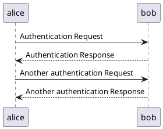

# Overview

Welcome to the **Aethyr** documentation portal.  This living document provides
an ever-expanding knowledge-base covering everything from high-level
architecture down to nitty-gritty implementation details.

Below is a taste of the powerful inline-diagram support enabled via [Kroki
](https://kroki.io) — the diagram is rendered *statically* during the build so
no external requests are needed at runtime:

