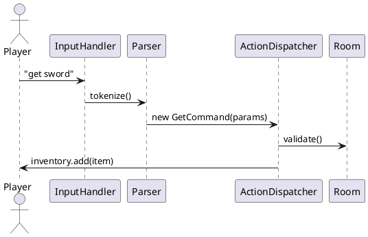

# Player Command Reference (Core)

This page enumerates **every** command currently implemented in Aethyr's core distribution.  Commands prefixed with `a` (e.g. `aset`) are reserved for administrators and are documented in the [Administration](../server/administration) guide.

> ℹ️  *Syntax Legend*
> 
> • **Literal** – Type exactly as shown.
> • *italics* – Replace with a variable.
> • Square brackets `[ ]` – Optional.

---

## 1. Movement & Navigation

| Command | Aliases | Description |
|---------|---------|-------------|
| `north` | `n` | Move to the room to the north if an exit exists. |
| `south` | `s` | Move south. |
| `east`  | `e` | Move east. |
| `west`  | `w` | Move west. |
| `up`    | `u` | Move upward. |
| `down`  | `d` | Move downward. |
| `look`  | `l` | Redisplay the current room or inspect an object. |
| `whereis *player*` | — | Show the room name and area of *player*. |

---

## 2. Communication

| Command | Usage | Notes |
|---------|-------|-------|
| `say *message*` | Local chat in the room. | Quoted aliases like `"` also work. |
| `tell *player* *msg*` | Private direct message. | |
| `whisper *player* *msg*` | Only those nearby can intercept. | |
| `feel *emotion*` | Triggers an emote from `emotes/`. | See `/emotes` for list. |
| `pose *text*` | Free-form emote. Example: `pose dances happily.` |

---

## 3. Inventory Management

| Command | Description |
|---------|-------------|
| `inventory` | List items you are carrying and wearing. |
| `get *item*` | Pick up *item* from the room. |
| `drop *item*` | Drop *item* on the ground. |
| `put *item* in *container*` | Place *item* inside *container*. |
| `wear *item*` | Equip wearable gear. |
| `remove *item*` | Unequip gear. |
| `wield *weapon*` | Ready a weapon slot. |
| `unwield *weapon*` | Stow weapon. |

---

## 4. Combat & Skills

| Command | Description |
|---------|-------------|
| `slash *target*` | Melee slashing attack. |
| `punch *target*` | Basic unarmed attack. |
| `kick *target*` | Knock-back attempt. |
| `simple_block` | Passive defence stance. |
| `simple_dodge` | Attempt to dodge next attack. |
| `skills` | Show current skill levels and XP. |
| `health` | Display hit points and satiety. |

---

## 5. Miscellaneous

| Command | Description |
|---------|-------------|
| `time`  | Show in-game (server) time. |
| `date`  | Current date according to server clock. |
| `satiety` | Hunger/thirst meter. |
| `map` | ASCII overview map of the area (if mapped). |
| `who` | List online players. |
| `quit` | Save and disconnect safely. |

---

## 6. In-Game Help System

Type `help [command]` to read a manual page.  The system automatically pulls from the command's class-level docstring.

```text
> help get
GET — Pick up an item from the ground.
Syntax: get <item>
```

---

## 7. Command Dispatch Flow



Happy adventuring! ✨ 