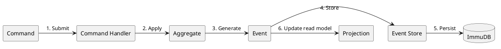

# Event Sourcing System

Aethyr implements a robust event sourcing architecture that provides a complete, immutable history of all changes to game objects. This document explains how the event sourcing system works, how to configure it, and how to leverage its capabilities for your server.

## What is Event Sourcing?

Event sourcing is an architectural pattern where all changes to application state are stored as a sequence of events. Instead of just storing the current state, the system records each state‐changing event as an immutable fact. This fundamental shift in data persistence creates a historical record that offers numerous advantages over traditional state‐based storage.

In traditional database systems, we store the current state of an object and update it in place when changes occur. This approach, while straightforward, loses valuable historical information. When did the change happen? Who made it? What was the previous state? These questions become difficult or impossible to answer.

Event sourcing takes a different approach. Rather than storing the current state, we store a sequence of events that, when replayed, reconstruct the current state. This provides several significant benefits:

- **Complete Audit Trail**: Every change is recorded with timestamps and causality, creating a comprehensive history of all actions in the game world. This is invaluable for debugging, security auditing, and understanding player behavior.
- **Temporal Queries**: With event sourcing, you can determine the state of any object at any point in time by replaying events up to that moment. This enables powerful features like "time travel debugging" and historical analysis.
- **Resilience**: Since the entire history is preserved, the system can be rebuilt from event history after crashes or data corruption. This provides a robust recovery mechanism that traditional databases lack.
- **Debugging**: Complex issues can be diagnosed by examining the sequence of events that led to a problematic state. This historical context is often crucial for understanding subtle bugs.
- **Analytics**: The event stream provides rich data for game balance and player behavior analysis. You can track how players interact with the world over time, identify patterns, and make data‐driven decisions about game design.

The following diagram illustrates the flow of data through the event sourcing system:



Let's walk through this flow step by step:

1. **Command Submission**: A command representing an intention to change the system state (e.g., "update room description") is submitted to the system.
2. **Command Handling**: The command handler validates the command and retrieves the appropriate aggregate (domain object) from the repository.
3. **Event Generation**: The aggregate applies business logic and generates one or more events representing the state changes.
4. **Event Storage**: The events are stored in the event store, which ensures they are persisted durably.
5. **Persistence**: The event store writes the events to ImmuDB, which provides tamper‐evident, immutable storage.
6. **Projection Updates**: The events are also sent to projections, which update read models optimized for specific query patterns.

This separation of commands (intentions) from events (facts) provides a clean architecture that is both powerful and flexible.

## Enabling Event Sourcing

Event sourcing is disabled by default in Aethyr to ensure backward compatibility with existing installations. To enable it, update your `conf/server.yml` configuration file.

```yaml
# Event sourcing configuration
event_sourcing:
  enabled: true
  snapshot_threshold: 100  # Create snapshots after this many events
```

The `snapshot_threshold` parameter determines how frequently the system creates snapshots of aggregate state. Snapshots are optimization points that reduce the number of events that need to be replayed when loading an aggregate. A lower threshold means more frequent snapshots, which can improve performance at the cost of increased storage usage.

After enabling event sourcing, restart your server for the changes to take effect. The system will automatically initialize the event store and begin recording events for all state changes.

## Core Concepts

To effectively use the event sourcing system, it's important to understand its core components and how they interact.

### 1. Commands

Commands represent intentions to change the state of the system. They are validated before processing and contain all necessary data to perform an operation. Commands are named using verbs in the imperative form (e.g., "CreateRoom", "UpdatePlayerPassword") to clearly express their intent.

Each command is a simple data structure that includes:
- The target aggregate's ID
- The data needed for the operation
- Validation rules to ensure the command is well-formed

Here's an example of creating and executing a command to update a room description:

```ruby
# Example: Command to update a room description
command = Aethyr::Core::EventSourcing::UpdateRoomDescription.new(
  id: room.goid,
  description: "A sunlit clearing surrounded by ancient trees."
)
Sequent.command_service.execute_commands(command)
```

Commands are immutable and represent a single operation. They should be focused and adhere to the Single Responsibility Principle. This makes the system easier to understand, test, and maintain.

### 2. Events

Events are immutable records of state changes. Each event captures a specific change to a game object and is named using verbs in the past tense (e.g., "RoomCreated", "PlayerPasswordUpdated") to indicate that they represent something that has already happened.

Events are the core of the event sourcing system. They are:
- Immutable: Once created, events never change
- Sequential: Events for an aggregate are ordered by a sequence number
- Persistent: Events are stored durably in the event store
- Replayable: Events can be replayed to reconstruct aggregate state

The Aethyr event sourcing system includes a variety of event types to capture different kinds of state changes:

```ruby
# Sample events that might be generated
GameObjectCreated
GameObjectAttributeUpdated
GameObjectContainerUpdated
PlayerCreated
RoomExitAdded
```

Each event type is designed to capture a specific kind of state change. For example, `GameObjectAttributeUpdated` captures a change to a single attribute of a game object, while `RoomExitAdded` captures the addition of an exit to a room.

Events are stored in the event store and can be retrieved to reconstruct the state of an aggregate or to analyze the history of changes.

### 3. Aggregates

Aggregates are domain objects that encapsulate business logic and state. They are the primary building blocks of the domain model and serve as consistency boundaries for transactions.

In Aethyr, the main aggregate types are:

- `GameObject`: Base aggregate for all game objects, providing common functionality like attribute management and container relationships.
- `Player`: Player-specific aggregate that extends GameObject with features like password management and admin status.
- `Room`: Room-specific aggregate that extends GameObject with features like description management and exit connections.

Aggregates handle commands by applying business logic and generating events. They also apply events to update their internal state. This dual responsibility ensures that the aggregate's state always reflects the events that have been applied to it.

For example, when a `Room` aggregate receives an `AddRoomExit` command, it validates the command, generates a `RoomExitAdded` event, and applies the event to update its internal state (adding the exit to its collection of exits).

### 4. Event Store

The event store is responsible for persisting events and providing methods to retrieve them. It's the backbone of the event sourcing system, ensuring that events are stored durably and can be retrieved efficiently.

Aethyr's event store implementation, `ImmudbEventStore`, provides several key features:

- **Atomic Operations**: Events are stored in atomic transactions, ensuring consistency.
- **Retry Logic**: The event store includes exponential backoff retry logic to handle transient failures.
- **Snapshot Support**: Snapshots provide optimization points that reduce the number of events that need to be replayed.
- **Comprehensive Metrics**: The event store collects metrics about its operations, providing visibility into system performance.
- **Fallback Mechanism**: If ImmuDB is unavailable, the event store falls back to file-based storage, ensuring the system can continue operating.

The event store is configured automatically when you enable event sourcing. You don't need to interact with it directly in most cases, as the command service and aggregate repository handle event storage and retrieval for you.

## Practical Examples

Let's explore some practical examples of how the event sourcing system works in Aethyr. These examples demonstrate how common operations generate and store events.

### Creating a New Room with Event Sourcing

When you create a room using the standard API, event sourcing happens automatically behind the scenes:

```ruby
# Create a room the normal way
room = $manager.create_object(Aethyr::Core::Objects::Room)
room.name = "Forest Clearing"
room.long_desc = "A peaceful clearing surrounded by tall trees."

# Behind the scenes, these events are generated:
# 1. GameObjectCreated
# 2. GameObjectAttributeUpdated (name)
# 3. GameObjectAttributeUpdated (long_desc)
```

In this example, we create a new room and set its name and description using the standard Aethyr API. The event sourcing system automatically captures these operations as events:

1. First, a `GameObjectCreated` event is generated when the room is created. This event includes the room's ID, type, and initial attributes.
2. When we set the room's name, a `GameObjectAttributeUpdated` event is generated with the key "name" and the value "Forest Clearing".
3. Similarly, when we set the room's description, another `GameObjectAttributeUpdated` event is generated with the key "long_desc" and the value "A peaceful clearing surrounded by tall trees".

These events are stored in the event store and can be replayed to reconstruct the room's state at any point in time.

### Updating a Player's Password

Password updates are another common operation that generates events:

```ruby
# Standard API call
$manager.set_password(player, "new_secure_password")

# This generates a PlayerPasswordUpdated event
```

When you update a player's password using the `set_password` method, the event sourcing system generates a `PlayerPasswordUpdated` event. This event includes the player's ID and the new password hash (not the password itself, for security reasons).

The event is stored in the event store and can be used to reconstruct the player's password hash when loading the player from the event store.

### Moving an Item Between Containers

Moving items between containers is a fundamental operation in most MUDs:

```ruby
# Standard game code
sword.container = player.goid

# This generates a GameObjectContainerUpdated event
```

When you move an item from one container to another by setting its `container` property, the event sourcing system generates a `GameObjectContainerUpdated` event. This event includes the item's ID and the ID of the new container.

The event is stored in the event store and can be used to track the movement of items throughout the game world.

## Querying Event History

One of the powerful features of event sourcing is the ability to examine the history of events for any game object. This can be invaluable for debugging, auditing, and understanding the evolution of the game world.

```ruby
# Get all events for a specific object
events = Sequent.configuration.event_store.load_events(object.goid)

# Print the event history
events.each do |event|
  puts "#{event.class.name} at sequence #{event.sequence_number}"
  puts "  #{event.attributes.inspect}"
end
```

This code retrieves all events for a specific game object and prints them to the console. Each event includes its type, sequence number, and attributes.

You can use this information to:
- Debug issues by examining the sequence of events that led to a problematic state
- Audit changes to sensitive objects like admin accounts
- Analyze player behavior by examining the events related to player actions
- Verify that the system is working correctly by checking that expected events are being generated

The event history provides a complete record of all changes to the game object, making it a powerful tool for understanding and managing your game world.

## Event Store Statistics

The event store collects comprehensive statistics about its operations, providing visibility into system performance and usage. You can access these statistics using the `event_store_stats` method:

```ruby
# In-game admin command
stats = $manager.event_store_stats
puts "Total events: #{stats[:event_count]}"
puts "Aggregates: #{stats[:aggregate_count]}"
puts "Snapshots: #{stats[:snapshot_count]}"
```

These statistics can help you monitor the health and performance of your event sourcing system. For example:
- A rapidly growing event count might indicate high activity or potential issues
- A low snapshot count relative to event count might suggest that you need to adjust your snapshot threshold
- A high failure count might indicate connectivity issues with ImmuDB

Regular monitoring of these statistics can help you identify and address issues before they impact player experience.

## Snapshots

For performance optimization, the event sourcing system creates snapshots after a configurable number of events (default: 100). Snapshots provide a checkpoint that reduces the number of events that need to be replayed when loading an aggregate.

```ruby
# Configure snapshot threshold in conf/server.yml
snapshot_threshold: 500  # Create snapshot after 500 events
```

Snapshots are particularly important for frequently updated objects like rooms in high-traffic areas or players who interact with the game world extensively. Without snapshots, loading these objects would require replaying hundreds or thousands of events, which could impact performance.

The snapshot threshold is a trade-off between performance and storage usage:
- A lower threshold means more frequent snapshots, which improves load performance but increases storage usage
- A higher threshold means fewer snapshots, which reduces storage usage but may impact load performance

You should adjust the threshold based on your specific needs and the characteristics of your game world. For example, a busy server with many players might benefit from a lower threshold to ensure responsive performance, while a smaller server might be fine with a higher threshold to conserve resources.

## Rebuilding World State

In case of data corruption or when migrating between servers, you can rebuild the entire world state from events. This is one of the powerful features of event sourcing—the ability to reconstruct the current state from the event history.

```ruby
# This rebuilds all game objects from their event history
Aethyr::Core::EventSourcing::SequentSetup.rebuild_world_state
```

When you call `rebuild_world_state`, the system:
1. Loads all aggregates from the event store
2. Replays all events for each aggregate to reconstruct its current state
3. Updates the in-memory representation of the game world to match the reconstructed state

This process ensures that the in-memory state is consistent with the event store, which is the source of truth for the system.

Rebuilding the world state is a powerful recovery mechanism, but it can be resource-intensive for large game worlds with many events. It's typically used in specific scenarios:
- After a server crash or data corruption
- When migrating to a new server
- During development and testing to verify that the event sourcing system is working correctly

For normal operation, the system automatically loads aggregates from the event store as needed, so you don't need to manually rebuild the world state.

## Fallback Mechanism

One of the key features of Aethyr's event sourcing implementation is its robust fallback mechanism. If ImmuDB is unavailable, the event store automatically falls back to file-based storage:

```
storage/events/{aggregate_id}/{sequence_number}.event  # Event files
storage/events/{aggregate_id}.sequence                 # Sequence counters
storage/events/snapshots/{aggregate_id}.snapshot       # Snapshots
```

This ensures your game can continue running even if the database is temporarily down. The file-based storage uses a simple directory structure:
- Each aggregate has its own directory named after its ID
- Each event is stored in a file named after its sequence number
- Sequence counters are stored in files at the root of the storage directory
- Snapshots are stored in a dedicated "snapshots" directory

When ImmuDB becomes available again, the system can migrate events from the file-based storage to ImmuDB, ensuring no data is lost during the outage.

This fallback mechanism provides several benefits:
- **Resilience**: The system can continue operating during database outages
- **Flexibility**: You can run the system without ImmuDB during development or testing
- **Data Integrity**: Events are still stored durably, even without ImmuDB
- **Seamless Recovery**: The system automatically handles the transition between storage mechanisms

The fallback mechanism is transparent to the rest of the system—commands, aggregates, and projections continue to work the same way regardless of the underlying storage mechanism.

## Advanced Configuration

For advanced configuration options, see the [ImmuDB Integration](immudb-integration) documentation. This includes details on:
- Configuring ImmuDB connection parameters
- Setting up authentication and security
- Optimizing performance for high-traffic servers
- Monitoring and troubleshooting the ImmuDB integration

The ImmuDB integration provides a robust, tamper‐evident storage backend for your event sourcing system, but it requires proper configuration to ensure optimal performance and reliability.

## Troubleshooting

### Common Issues

#### Events Not Being Recorded

If events aren't being recorded, there are several potential causes:

1. **Event Sourcing Not Enabled**: Verify that event sourcing is enabled in `conf/server.yml`. The `event_sourcing.enabled` setting should be set to `true`.
2. **ImmuDB Connection Issues**: Check the ImmuDB connection settings in `conf/server.yml`. Make sure the address, port, username, and password are correct. You can also check the ImmuDB logs for connection errors.
3. **Log Errors**: Look for errors in `logs/system.log`. The event sourcing system logs detailed information about errors, which can help identify the root cause.

If you've verified these settings and are still having issues, try restarting the server to ensure the configuration changes take effect. If the problem persists, you may need to check for more specific errors in the logs or consult the ImmuDB documentation for troubleshooting steps.

#### Performance Concerns

If you notice performance degradation after enabling event sourcing, there are several steps you can take:

1. **Increase Snapshot Threshold for Frequently Updated Objects**: If certain objects are updated frequently, consider increasing the snapshot threshold for those objects. This reduces the overhead of creating snapshots but may increase load times.
2. **Ensure ImmuDB Has Sufficient Resources**: ImmuDB performance depends on available CPU, memory, and disk I/O. Make sure your ImmuDB server has sufficient resources for your workload.
3. **Consider Using the File-Based Fallback for Development Environments**: The file-based fallback is simpler and may be more appropriate for development environments where performance is less critical.
4. **Optimize Your Domain Model**: Review your domain model to ensure it's efficiently using events. Avoid generating unnecessary events or storing large amounts of data in events.

Performance tuning is often an iterative process. Monitor system performance after making changes and adjust as needed based on the results.

#### Recovery After Crashes

If your server crashes, the event sourcing system provides robust recovery mechanisms:

1. **Restart the Server Normally**: In most cases, simply restarting the server is sufficient. The event sourcing system will automatically rebuild state from events as needed.
2. **Check for Data Corruption**: If you suspect data corruption, check the logs for errors during startup. The event sourcing system performs consistency checks when loading aggregates.
3. **Manually Trigger a Rebuild**: If issues persist, you can manually trigger a rebuild of the world state using `Aethyr::Core::EventSourcing::SequentSetup.rebuild_world_state`. This forces a complete reconstruction of all aggregates from their event history.
4. **Restore from Backup**: As a last resort, you can restore from a backup of the event store. This should be rare, as the event sourcing system is designed to be resilient to crashes.

The event sourcing system's ability to reconstruct state from events makes it inherently resilient to crashes. In most cases, recovery is automatic and requires no manual intervention.

## Next Steps

Now that you understand the basics of Aethyr's event sourcing system, you can explore more advanced topics:

- [ImmuDB Integration](immudb-integration) - Learn how to configure and optimize the ImmuDB backend for your event sourcing system.
- [Event Sourcing API](../developer/event-sourcing-api) - Detailed API documentation for developers who want to extend or customize the event sourcing system.

By leveraging the power of event sourcing, you can build a more robust, maintainable, and feature‐rich game world for your players.

## What is Event Sourcing?

Event sourcing is an architectural pattern where all changes to application state are stored as a sequence of events. Instead of just storing the current state, the system records each state-changing event. This provides several benefits:

- **Complete Audit Trail**: Every change is recorded with timestamps and causality
- **Temporal Queries**: Ability to determine the state of any object at any point in time
- **Resilience**: System can be rebuilt from event history after crashes
- **Debugging**: Complex issues can be diagnosed by examining event sequences
- **Analytics**: Rich data for game balance and player behavior analysis


## Enabling Event Sourcing

Event sourcing is disabled by default. To enable it, update your `conf/server.yml` configuration:

```yaml
# Event sourcing configuration
event_sourcing:
  enabled: true
  snapshot_threshold: 100  # Create snapshots after this many events
```

## Core Concepts

### 1. Commands

Commands represent intentions to change the state of the system. They are validated before processing and contain all necessary data to perform an operation.

```ruby
# Example: Command to update a room description
command = Aethyr::Core::EventSourcing::UpdateRoomDescription.new(
  id: room.goid,
  description: "A sunlit clearing surrounded by ancient trees."
)
Sequent.command_service.execute_commands(command)
```

### 2. Events

Events are immutable records of state changes. Each event captures a specific change to a game object.

```ruby
# Sample events that might be generated
GameObjectCreated
GameObjectAttributeUpdated
GameObjectContainerUpdated
PlayerCreated
RoomExitAdded
```

### 3. Aggregates

Aggregates are domain objects that encapsulate business logic and state. In Aethyr, these include:

- `GameObject`: Base aggregate for all game objects
- `Player`: Player-specific aggregate
- `Room`: Room-specific aggregate

### 4. Event Store

The event store persists events in ImmuDB (with file-based fallback). It provides:

- Atomic operations
- Retry logic
- Snapshot support
- Comprehensive metrics

## Practical Examples

### Creating a New Room with Event Sourcing

When you create a room using the standard API, event sourcing happens automatically:

```ruby
# Create a room the normal way
room = $manager.create_object(Aethyr::Core::Objects::Room)
room.name = "Forest Clearing"
room.long_desc = "A peaceful clearing surrounded by tall trees."

# Behind the scenes, these events are generated:
# 1. GameObjectCreated
# 2. GameObjectAttributeUpdated (name)
# 3. GameObjectAttributeUpdated (long_desc)
```

### Updating a Player's Password

```ruby
# Standard API call
$manager.set_password(player, "new_secure_password")

# This generates a PlayerPasswordUpdated event
```

### Moving an Item Between Containers

```ruby
# Standard game code
sword.container = player.goid

# This generates a GameObjectContainerUpdated event
```

## Querying Event History

You can examine the event history for any game object:

```ruby
# Get all events for a specific object
events = Sequent.configuration.event_store.load_events(object.goid)

# Print the event history
events.each do |event|
  puts "#{event.class.name} at sequence #{event.sequence_number}"
  puts "  #{event.attributes.inspect}"
end
```

## Event Store Statistics

To view statistics about your event store:

```ruby
# In-game admin command
stats = $manager.event_store_stats
puts "Total events: #{stats[:event_count]}"
puts "Aggregates: #{stats[:aggregate_count]}"
puts "Snapshots: #{stats[:snapshot_count]}"
```

## Snapshots

For performance optimization, the event sourcing system creates snapshots after a configurable number of events (default: 100). Snapshots provide a checkpoint that reduces the number of events that need to be replayed when loading an aggregate.

```ruby
# Configure snapshot threshold in conf/server.yml
snapshot_threshold: 500  # Create snapshot after 500 events
```

## Rebuilding World State

In case of data corruption or when migrating between servers, you can rebuild the entire world state from events:

```ruby
# This rebuilds all game objects from their event history
Aethyr::Core::EventSourcing::SequentSetup.rebuild_world_state
```

## Fallback Mechanism

If ImmuDB is unavailable, the event store automatically falls back to file-based storage:

```
storage/events/{aggregate_id}/{sequence_number}.event  # Event files
storage/events/{aggregate_id}.sequence                 # Sequence counters
storage/events/snapshots/{aggregate_id}.snapshot       # Snapshots
```

This ensures your game can continue running even if the database is temporarily down.

## Advanced Configuration

For advanced configuration options, see the [ImmuDB Integration](immudb-integration) documentation.

## Troubleshooting

### Common Issues

#### Events Not Being Recorded

If events aren't being recorded:

1. Verify event sourcing is enabled in `conf/server.yml`
2. Check ImmuDB connection settings
3. Look for errors in `logs/system.log`

#### Performance Concerns

If you notice performance degradation:

1. Increase the snapshot threshold for frequently updated objects
2. Ensure ImmuDB has sufficient resources
3. Consider using the file-based fallback for development environments

#### Recovery After Crashes

If your server crashes:

1. Restart the server normally
2. The event sourcing system will automatically rebuild state from events
3. If issues persist, manually trigger a rebuild with `Aethyr::Core::EventSourcing::SequentSetup.rebuild_world_state`

## Next Steps

- [ImmuDB Integration](immudb-integration) - Learn how to configure and optimize the ImmuDB backend
- [Event Sourcing API](../developer/event-sourcing-api) - Detailed API documentation for developers
