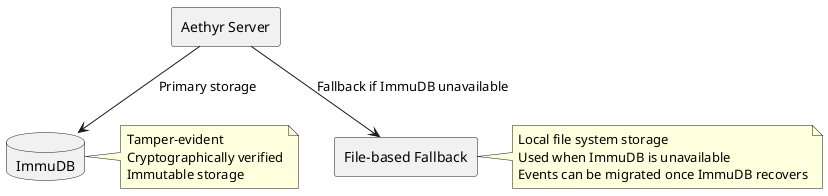
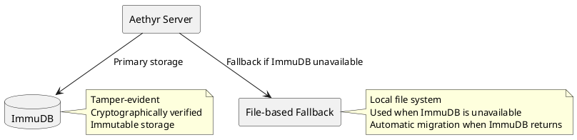

# ImmuDB Integration

Aethyr uses [ImmuDB](https://immudb.io/) as the primary backend for its event sourcing system. ImmuDB is an immutable database that provides tamper‐evident storage with cryptographic verification, making it an ideal choice for event sourcing. This document provides a comprehensive guide to understanding, configuring, and optimizing the ImmuDB integration in Aethyr.

## Why ImmuDB?

The choice of database is critical for an event sourcing system. Traditional databases are designed for mutable data, where records can be updated or deleted. Event sourcing, however, requires an append‐only store where events are never modified once written. ImmuDB is specifically designed for this use case, offering several key advantages:

1. **Immutability**: Once data is written to ImmuDB, it cannot be modified or deleted. This aligns perfectly with the immutable nature of events in an event sourcing system. Immutability ensures that your event history remains intact and cannot be tampered with, even by administrators with database access.
2. **Cryptographic Verification**: ImmuDB uses Merkle trees to provide cryptographic verification of data integrity. This means you can verify that your event history has not been tampered with, providing an additional layer of security and trust. Each transaction in ImmuDB is cryptographically linked to all previous transactions, creating a tamper‐evident chain.
3. **Simplicity**: ImmuDB's key‐value API is straightforward to use, making it easy to integrate with Aethyr's event sourcing system. The simplicity of the API reduces the complexity of the integration code and minimizes the risk of bugs or performance issues.
4. **Performance**: ImmuDB is designed for high throughput and low latency, making it suitable for the demands of a busy game server. It can handle thousands of transactions per second with sub‐millisecond latency, ensuring that your event sourcing system doesn't become a bottleneck.
5. **Lightweight**: ImmuDB has a small footprint and can run on modest hardware, making it accessible for small to medium‐sized game servers. It can be deployed alongside your Aethyr server on the same machine, simplifying your infrastructure.

### Architecture Overview

The following diagram illustrates how Aethyr integrates with ImmuDB and the file‐based fallback mechanism:



In this architecture:
- Aethyr attempts to use ImmuDB as the primary storage for events.
- If ImmuDB is unavailable, Aethyr automatically falls back to file‐based storage.
- When ImmuDB becomes available again, events can be migrated from the file‐based storage.
- Both storage mechanisms provide the same functionality to the event sourcing system.

This dual‐storage approach ensures that your game can continue running even during database outages, providing a robust foundation for your event sourcing system.

## Installation

Before you can use ImmuDB with Aethyr, you need to install and configure ImmuDB. There are several ways to install ImmuDB, depending on your environment and preferences.

### Docker (Recommended)

The easiest way to run ImmuDB is using Docker. This approach provides a clean, isolated environment for ImmuDB and simplifies management.

```bash
docker run -d --name immudb -p 3322:3322 codenotary/immudb:latest
```

This command starts ImmuDB in a Docker container, exposing port 3322 for client connections. The container runs in the background (`-d` flag) and is named "immudb" for easy reference.

For production environments, consider additional configuration options:
- Mount a volume for persistent storage: `-v /path/to/data:/var/lib/immudb`
- Set environment variables for configuration: `-e IMMUDB_ADDRESS=0.0.0.0`
- Configure network settings: `--network=host` or `--network=your_network`

Refer to the [ImmuDB Docker documentation](https://docs.immudb.io/master/running/docker.html) for more details on Docker‐based deployment.

### Binary Installation

Alternatively, you can install the ImmuDB binary directly:

```bash
# Download the latest release
curl -L https://github.com/codenotary/immudb/releases/latest/download/immudb-v1.4.1-linux-amd64 \
  -o immudb

# Make it executable
chmod +x immudb

# Run ImmuDB
./immudb
```

For production environments, consider:
- Creating a dedicated user for ImmuDB: `useradd -r immudb`
- Setting up a systemd service for automatic startup
- Configuring firewall rules to protect the ImmuDB port
- Setting up regular backups of the ImmuDB data directory

Refer to the [ImmuDB installation documentation](https://docs.immudb.io/master/running/download.html) for more details on binary installation.

### Verifying Installation

After installing ImmuDB, verify that it's running correctly:

```bash
# Using the immuadmin tool (if installed)
immuadmin status

# Or using telnet to check port availability
telnet localhost 3322

# Or using curl to check the HTTP API (if enabled)
curl http://localhost:8080/readiness
```

A successful response indicates that ImmuDB is running and ready to accept connections.

## Why ImmuDB?

The choice of database is critical for an event sourcing system. ImmuDB offers several key advantages:

1. **Immutability**: Data, once written, cannot be modified or deleted, preserving a complete and tamper‐evident history.
2. **Cryptographic Verification**: Uses Merkle trees to ensure data integrity, allowing you to verify that no event has been altered.
3. **Simplicity**: A straightforward key‐value API that reduces integration complexity.
4. **Performance**: Designed for high throughput and low latency, making it suitable for busy game servers.
5. **Lightweight**: Minimal resource footprint, facilitating deployment on modest hardware.

### Architecture Overview


## Why ImmuDB?

ImmuDB offers several advantages for an event sourcing system:

1. **Immutability**: Once data is written, it cannot be modified or deleted
2. **Cryptographic Verification**: All data is cryptographically verified
3. **Simplicity**: Key-value API is straightforward to use
4. **Performance**: High throughput and low latency
5. **Lightweight**: Small footprint and easy deployment



## Installation

### Docker (Recommended)

The easiest way to run ImmuDB is using Docker:

```bash
docker run -d --name immudb -p 3322:3322 codenotary/immudb:latest
```

### Binary Installation

Alternatively, you can install the ImmuDB binary directly:

```bash
# Download the latest release
curl -L https://github.com/codenotary/immudb/releases/latest/download/immudb-v1.4.1-linux-amd64 \
  -o immudb

# Make it executable
chmod +x immudb

# Run ImmuDB
./immudb
```

## Configuration

### Server Configuration

Configure ImmuDB connection settings in your `conf/server.yml`:

```yaml
# ImmuDB configuration
immudb:
  address: "127.0.0.1"  # ImmuDB server address
  port: 3322            # ImmuDB server port
  username: "immudb"    # ImmuDB username
  password: "immudb"    # ImmuDB password
  database: "aethyr"    # ImmuDB database name
```

### Environment Variables

You can also configure ImmuDB using environment variables:

```bash
export IMMUDB_ADDRESS="127.0.0.1"
export IMMUDB_PORT=3322
export IMMUDB_USERNAME="immudb"
export IMMUDB_PASSWORD="immudb"
export IMMUDB_DATABASE="aethyr"
```

### Advanced Configuration

For advanced scenarios, you can configure retry behavior and snapshot frequency:

```yaml
# Advanced ImmuDB configuration
immudb:
  # ... basic settings ...
  retry_count: 5           # Number of retry attempts
  retry_delay: 0.5         # Base delay between retries (seconds)
  snapshot_threshold: 100  # Create snapshots after this many events
```

## Data Structure

ImmuDB stores events using a key-value structure:

| Key Pattern                               | Value               | Description                          |
|-------------------------------------------|---------------------|--------------------------------------|
| `event:{aggregate_id}:{sequence_number}`  | Serialized event    | Individual events                    |
| `sequence:{aggregate_id}`                 | Sequence number     | Current sequence for aggregate       |
| `snapshot:{aggregate_id}`                 | Serialized snapshot | Latest snapshot for aggregate        |

## Monitoring

### Event Store Statistics

You can view statistics about your ImmuDB event store:

```ruby
# Get event store statistics
stats = Sequent.configuration.event_store.statistics

puts "Events stored: #{stats[:events_stored]}"
puts "Events loaded: #{stats[:events_loaded]}"
puts "Store failures: #{stats[:store_failures]}"
puts "Snapshots stored: #{stats[:snapshots_stored]}"
```

### ImmuDB Health Check

To verify ImmuDB is running correctly:

```ruby
# Check ImmuDB connection
begin
  client = ImmuDB::Client.new(
    address: ServerConfig[:immudb_address],
    port: ServerConfig[:immudb_port],
    username: ServerConfig[:immudb_username],
    password: ServerConfig[:immudb_password]
  )
  
  # Try a simple operation
  client.set("health_check", "ok")
  result = client.get("health_check")
  
  puts "ImmuDB connection successful: #{result == 'ok'}"
rescue => e
  puts "ImmuDB connection failed: #{e.message}"
end
```

## Backup and Recovery

### Backing Up ImmuDB

To back up your ImmuDB data:

```bash
# Using immuadmin tool
immuadmin backup -d /path/to/backup

# Or using Docker
docker exec immudb immuadmin backup -d /backup
```

### Restoring from Backup

To restore from a backup:

```bash
# Stop ImmuDB
docker stop immudb

# Restore from backup
docker run -it --rm -v /path/to/backup:/backup \
  -v /path/to/immudb/data:/data \
  codenotary/immudb:latest \
  immuadmin restore -d /backup

# Restart ImmuDB
docker start immudb
```

## Fallback Mechanism

If ImmuDB is unavailable, the event store automatically falls back to file-based storage:

```ruby
# The event store checks ImmuDB availability on initialization
begin
  require 'immudb-ruby'
  @use_immudb = true
  # ... initialize ImmuDB client ...
rescue LoadError => e
  log "ImmuDB not available, using file-based event store: #{e.message}", Logger::Medium
  @use_immudb = false
  @storage_path = config[:storage_path] || "storage/events"
  FileUtils.mkdir_p(@storage_path)
end
```

### File Structure

The file-based fallback uses the following structure:

```
storage/events/{aggregate_id}/{sequence_number}.event  # Event files
storage/events/{aggregate_id}.sequence                 # Sequence counters
storage/events/snapshots/{aggregate_id}.snapshot       # Snapshots
```

### Migrating from File-Based to ImmuDB

When ImmuDB becomes available again, you can migrate events from the file-based storage:

```ruby
# Migrate events from file-based storage to ImmuDB
def migrate_to_immudb
  return unless @use_immudb
  
  # Scan the file-based storage directory
  Dir.glob(File.join(@storage_path, "*")).each do |aggregate_dir|
    next unless File.directory?(aggregate_dir)
    
    aggregate_id = File.basename(aggregate_dir)
    
    # Load events from files
    events = load_events_from_files(aggregate_id)
    
    # Store events in ImmuDB
    store_events_in_immudb(aggregate_id, events)
    
    # Load and store snapshot if available
    snapshot = load_snapshot_from_file(aggregate_id)
    store_snapshot_in_immudb(aggregate_id, snapshot) if snapshot
  end
end
```

## Performance Tuning

### Optimizing ImmuDB

For optimal performance:

1. **Hardware**: Provide sufficient RAM and fast SSD storage
2. **Configuration**: Adjust ImmuDB settings in `immudb.toml`:
   ```toml
   [store]
   max_concurrent_opens = 100
   max_io_concurrency = 8
   sync_frequency = 20
   ```
3. **Snapshots**: Adjust snapshot threshold based on your usage patterns

### Batch Operations

For bulk operations, use batch commands:

```ruby
# Batch store multiple events
events_by_aggregate = events.group_by(&:aggregate_id)
events_by_aggregate.each do |aggregate_id, aggregate_events|
  # Prepare batch operation
  event_data = aggregate_events.map.with_index do |event, index|
    sequence_number = current_sequence + index + 1
    {
      key: "event:#{aggregate_id}:#{sequence_number}",
      value: serialize_event(event, sequence_number)
    }
  end
  
  # Execute batch operation
  @client.set_all(event_data)
end
```

## Troubleshooting

### Connection Issues

If you're having trouble connecting to ImmuDB:

1. **Verify ImmuDB is running**:
   ```bash
   docker ps | grep immudb
   ```

2. **Check network connectivity**:
   ```bash
   telnet 127.0.0.1 3322
   ```

3. **Verify credentials**:
   ```ruby
   client = ImmuDB::Client.new(
     address: "127.0.0.1",
     port: 3322,
     username: "immudb",
     password: "immudb"
   )
   # If this raises an exception, credentials are incorrect
   ```

### Data Corruption

If you suspect data corruption:

1. **Verify ImmuDB integrity**:
   ```bash
   immuadmin verify
   ```

2. **Rebuild from events**:
   ```ruby
   Aethyr::Core::EventSourcing::SequentSetup.rebuild_world_state
   ```

3. **Restore from backup** as a last resort

## Next Steps

- [Event Sourcing System](event-sourcing) - Learn about the event sourcing architecture
- [Event Sourcing API](../developer/event-sourcing-api) - Detailed API documentation for developers
