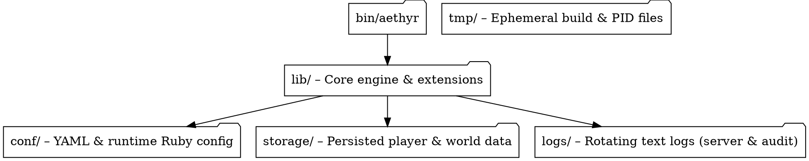
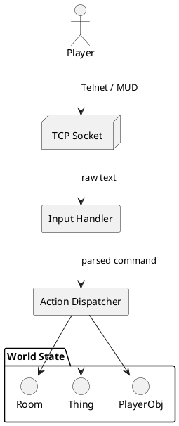

import Tabs from '@theme/Tabs';
import TabItem from '@theme/TabItem';

# Running an Aethyr Server

This guide walks you through **starting**, **stopping**, and **maintaining** an Aethyr game server in both development and production environments.  Everything herein reflects functionality that *currently* exists in the code-base—no vapor-ware.

> 📚  *New to Aethyr?*  You may want to skim the [Overview](../overview) first.

---

## 1. Prerequisites

* **Ruby ≥ 3.0** – The server itself is written in Ruby.  Any patch-level version that satisfies the `Gemfile` will work.
* **Bundler** – For installing gem dependencies (`gem install bundler`).
* **Docker & Docker-Compose** *(optional but recommended)* – Provides a fully-isolated environment that mirrors production.
* **A POSIX-compatible shell** – All examples assume *bash/zsh* on Linux/macOS.  Windows users can employ WSL.

---

## 2. Quick-start with Docker

The repository ships with a battle-tested `docker-compose.yml`.  This is the **fastest** way to spin up a server for evaluation or CI pipelines.

```bash title="Boot the server on port 1337"
$ docker compose up --build
```

Once the container reports that it is **Listening on 0.0.0.0:8888**, connect via *telnet* or *MUD client* to `localhost:1337`.

### Exposed Volume Layout

The compose file mounts your local workspace into */usr/src/app* inside the container so changes you make on the host are hot-reloaded.

```text
Host Path                 ↔   Container Path
──────────────────────────┼────────────────────────
.                         ↔  /usr/src/app          
./storage                 ↔  /usr/src/app/storage  
./conf                    ↔  /usr/src/app/conf     
./logs                    ↔  /usr/src/app/logs     
```

Feel free to uncomment individual mounts in `docker-compose.yml` if you wish to *persist* world state separately from your code revisions.

---

## 3. Native Execution (Without Docker)

```bash title="Install gem dependencies"
$ bundle install

# Start the server with default configuration
$ bin/aethyr
```

Command-line flags are defined in `bin/aethyr`:

```bash
-v, --verbose   # Increase log verbosity
--flag VALUE    # Set an arbitrary runtime flag exposed to scripts
```

!!! note
    The binary simply delegates to the **`Aethyr::main`** entry-point after setting up logging according to your flags.

---

## 4. File-system Anatomy

Below is a high-level overview of directories that matter at run-time.



---

## 5. Lifecycle Commands

The Aethyr runtime exposes several **administrative** commands that can be issued *in-game* while logged in as an **Immortal** (administrator).  The table below lists the most common.

| Command | Purpose | Typical Usage |
|---------|---------|---------------|
| `areload` | Reload classes & world definitions without a full restart | `areload lib/aethyr/extensions` |
| `aset`    | Adjust an attribute on any in-memory object | `aset <room-id> name "Dark Cave"` |
| `awatch`  | Follow a player invisibly for debugging | `awatch <player-name>` |
| `restart` | Gracefully restart the entire server process | `restart` |

!!! danger "Hot Reload Caveats"
    While *class reloading* is robust for most gameplay code, **schema migrations** to saved storage objects still require a full restart followed by a rake **upgrade** task (see next section).

---

## 6. Upgrading & World Migrations

World data lives under `storage/` in a flat directory hierarchy: one file per persisted object.  When you upgrade the engine to a newer version you might have to run the included Rake task:

```bash title="Update serialized objects in-place"
$ bundle exec rake storage:migrate
```

The task walks every file, deserialises it, applies monkey-patch migrations defined in `lib/aethyr/migrations/*.rb`, and writes it back.  Always **back-up** the directory beforehand.

---

## 7. Graceful Shutdown

Press **Ctrl-C** in the foreground terminal or issue the in-game `shutdown` admin command.  Either route signals the reactor loop to:

1. Save *all dirty* in-memory objects to `storage/`.
2. Flush unsent log messages.
3. Close listening sockets.

Execution then returns to your shell with exit status `0`.

---

## 8. Architecture at 10,000 ft



---

## 9. Next Steps

* **[Server Administration](administration)** – Deeper dive into live management, auditing, and security.
* **[World-building](world-building)** – Create rooms, exits, objects, and interactive NPCs.
* **[Player Commands](../player/commands)** – Everything an adventurer can type.

Happy hosting! ✨ 