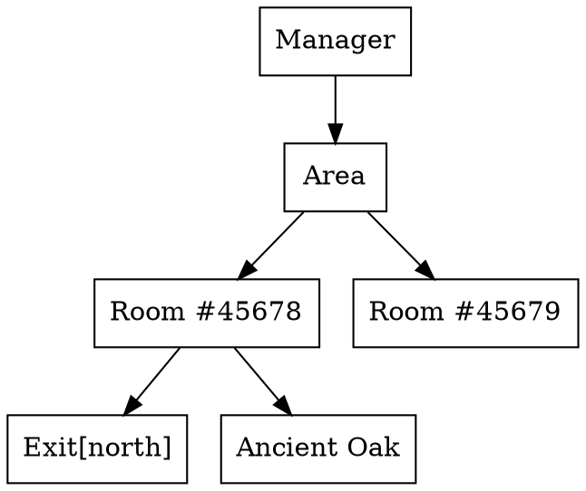

# Building Worlds – Rooms, Objects & Exits

Welcome, Architect!  This document introduces every tool at your disposal for sculpting immersive spaces inside Aethyr.  We focus on **features that exist right now**—nothing speculative.

---

## 1. Terminology

| Term | In-Code Class | Description |
|------|--------------|-------------|
| **Room** | `Aethyr::Core::Objects::Room` | A location players can occupy. |
| **Exit** | `Aethyr::Core::Objects::Exit` | A directional link between two rooms. |
| **Thing** | `Aethyr::Core::Objects::Thing` | Any interactive object that is **not** a container or character. |
| **Container** | `Aethyr::Core::Objects::Container` | A `Thing` that can hold other objects. |

---

## 2. Creation Workflow (In-Game)

### 2.1 Rooms

```text
> acreate room "Sunny Meadow"
Room #45678 created.
```

The new room inherits the *area* of the creator's current room unless you specify `area:<name>`.

### 2.2 Exits

```text
# While standing inside "Sunny Meadow"
> acreate exit north to "Dark Forest"
Exit north leads to Room #45679
```

`north`, `south`, `east`, `west`, `up`, `down` are canonical directions; anything else becomes a *portal*.

### 2.3 Objects & Containers

```text
> acreate thing "Ancient Oak" here
> aset Ancien*t Oak description "A massive oak tree older than time itself."
```

Objects default to the current room if no explicit location is given.

---

## 3. Under the Hood – Object Graph

The following GraphViz diagram shows how newly-created entities attach to the *world tree* rooted at the global **Manager** singleton.



---

## 4. Persisting to Disk

All world-building commands immediately serialise the affected object(s) into YAML files under `storage/world/` (one file per object).  No extra steps required.

!!! tip
    If you prefer editing YAML directly, shut down the server first, then hack away—restarting will auto-load your changes.

---

## 5. Bulk Editing via `aset`

`aset` accepts a **selector** prefix:

```text
> aset area:StarterZone terrain_type forest
```

Valid selectors: `here`, `room:<id>`, `area:<name>`, `type:<class>`.

---

## 6. Terrain & Atmosphere Helpers

Rooms can advertise environmental flags:

```text
> aset here terrain.indoors true
> aset here terrain.water true
```

### Affect on Built-in Commands

* `look` – Prepends *"You are indoors."* or *"You are swimming."*
* `move` – Applies movement cost modifiers.

---

Continue to the **Developer** guide for low-level APIs & extension points → 